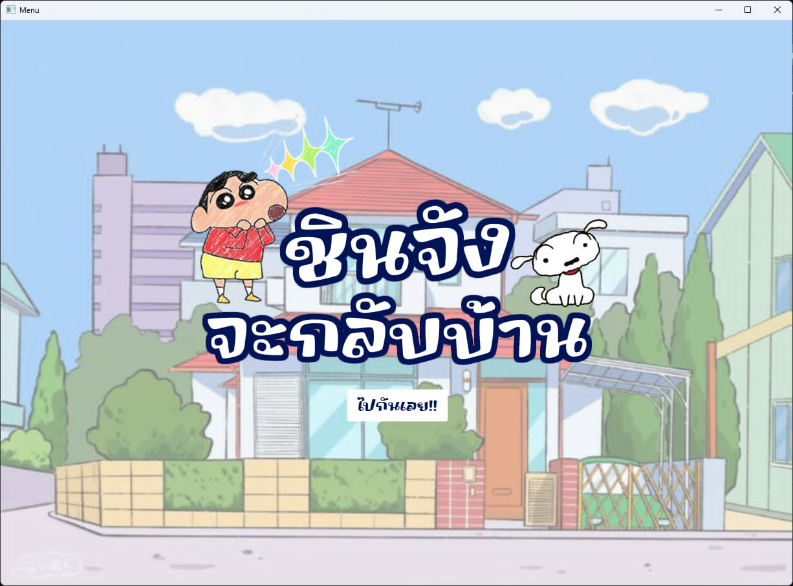

## Getting Started

1. Clone the repository.

```bash
  git clone https://github.com/B-bsw/Project_OOP.git
  cd Project_OOP
```

2. Setup Java
   
   **java** version `23`

3. Run Program by gradle ( groovy )

- linux/mac/wsl
```bash
  gradle run
```
- windows
```bash
  ./gradlew run
```
## Preview
<div align='center'>
  
</div>
